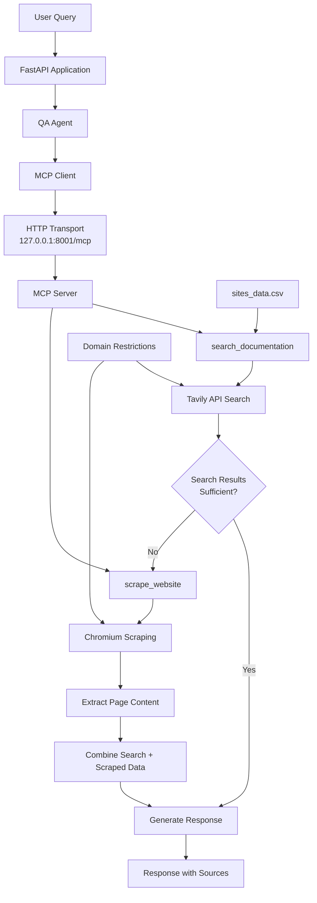

# Domain-Specific Q&A Agent: RAG alternative using MCP

**This project showcases a simpler, more practical alternative to traditional RAG systems** - demonstrating how modern search APIs combined with large context windows can eliminate the complexity of Retrieval-Augmented Generation for many documentation Q&A use cases.

This project builds on the [previous Q&A agent implementation](https://github.com/javiramos1/qagent), enhancing it with **Model Context Protocol (MCP)** architecture for better tool isolation, scalability, and maintainability. The tools now run in a separate MCP server process, providing cleaner separation of concerns and enabling distributed deployments.

> **📚 For detailed analysis of why search-first approaches beat RAG in 2025** (cost comparisons, performance advantages, model selection strategies), see the [original project documentation](https://github.com/javiramos1/qagent#-why-search-first-beats-rag-in-2025).

## 🆕 What's New with MCP

This enhanced version introduces **Model Context Protocol (MCP)** architecture:

- **🔗 Tool Isolation**: Search and scraping tools run in separate MCP server process
- **📡 HTTP Transport**: Reliable HTTP-based communication between FastAPI app and MCP server  
- **🏗️ Scalable Architecture**: MCP server can run on different machines for distributed deployments
- **🛠️ Better Development**: FastMCP inspector allows interactive tool testing
- **📋 Standardization**: Follows Model Context Protocol specification for interoperability
- **🐳 Production Ready**: Enhanced Docker setup with multi-service orchestration

## 🚀 Key Features

- **🎯 Smart Tool Selection**: Automatically chooses between fast search and comprehensive scraping based on query needs
- **🔍 Domain-Restricted Search**: Only searches approved organizational documentation websites
- **🧠 Web Scraping Fallback**: Comprehensive page scraping when search results are insufficient  
- **⚡ MCP Architecture**: Tools run in separate MCP server process for better isolation and scalability
- **🔗 HTTP Transport**: Reliable HTTP-based communication between FastAPI app and MCP server
- **📝 Intelligent Summarization**: Optional AI-powered result summarization reduces token usage by 60-80%
- **💰 Cost-Competitive**: At $0.005-$0.075 per query, often cheaper than traditional RAG systems
- **⚡ Performance Optimized**: Fast search for 90% of queries, deep scraping only when needed
- **🛡️ Data Security**: No sensitive data sent to vector databases or training systems
- **📊 Transparent Sources**: Every answer includes clear source attribution from official documentation
- **🔧 Easy Configuration**: Simple CSV file controls which knowledge sources are accessible
- **💬 Conversation Memory**: Maintains context across multiple questions in a session
- **🎮 Production Ready**: FastAPI backend with proper error handling and logging

## 🚀 Quick Start

### Setting Up Your Knowledge Sources

To configure which websites your agent can search, edit the `sites_data.csv` file. This CSV defines your agent's knowledge boundaries and domains:

```csv
domain,site,description
AI Agent Frameworks,github.com/openai/swarm,OpenAI Swarm documentation for lightweight multi-agent orchestration
AI Operations,docs.agentops.ai,AgentOps documentation for testing debugging and deploying AI agents and LLM apps
AI Data Frameworks,docs.llamaindex.ai,LlamaIndex documentation for building LLM-powered agents over your data
```

**CSV Structure:**
- **domain**: The subject area or topic (e.g., "AI Agents", "Web Development", "Machine Learning")
- **site**: The actual website domain to search (e.g., "docs.langchain.com", "docs.python.org")
- **description**: A clear explanation of what the site contains and when to use it

**Pro Tip:** The description is crucial - it's what the agent uses to decide whether a particular site will be helpful for answering a user's question. Be specific about what topics and types of information each site covers.

### Obtaining API Keys

#### Getting a Tavily API Key:
1. Go to [tavily.com](https://tavily.com) and sign up for a free account
2. Navigate to your dashboard or API section
3. Find your API key in the dashboard
4. Tavily offers a generous free tier with thousands of searches per month

#### Getting a Google API Key:
1. Visit [ai.google.dev](https://ai.google.dev) (Google AI Studio)
2. Sign in with your Google account
3. Click "Get API Key" or navigate to the API keys section
4. Create a new project if needed
5. Generate your API key
6. Google's Gemini API includes a substantial free tier

After obtaining both keys, add them to your `.env` file:
```bash
TAVILY_API_KEY=your_tavily_key_here
GOOGLE_API_KEY=your_google_key_here
```

**Security Note:** Keep these keys secure and never commit them to public repositories. Both services offer excellent free tiers suitable for development and small-scale production use.

**🐳 Quick Start Options:** Choose between local development (Option 1-2) or Docker (Option 3). **Docker is recommended for production** as it handles service orchestration automatically.

### Option 1: Using Make (Recommended for Development)

```bash
# Clone the repository
git clone https://github.com/javiramos1/qagent-mcp.git
cd qagent-mcp

# Setup environment and install dependencies
make install

# Copy and configure environment variables
cp .env.example .env
# Edit .env with your API keys

# Start MCP server (Terminal 1)
make mcp-server

# Start FastAPI application (Terminal 2)
make run
```

### Option 2: Manual Setup (For Learning)

```bash
# Clone and setup
git clone https://github.com/javiramos1/qagent-mcp.git
cd qagent-mcp

# Create virtual environment
python3 -m venv qagent_venv
source qagent_venv/bin/activate

# Install dependencies
pip install -r requirements.txt

# Configure environment
cp .env.example .env
# Edit .env with your API keys

# Start MCP server (Terminal 1)
qagent_venv/bin/fastmcp run mcp_server.py --transport streamable-http --port 8001

# Start FastAPI app (Terminal 2)
python main.py
```

### Option 3: Docker Compose (Production Ready)

The Docker setup automatically runs both the MCP server and FastAPI client in separate containers with proper networking:

```bash
# Clone and setup
git clone https://github.com/javiramos1/qagent-mcp.git
cd qagent-mcp

# Configure environment
cp .env.example .env
# Edit .env with your API keys

# Build and start both services
make docker-build
make docker-run

# Check service health
make docker-logs

# Access the API at http://localhost:8000
# MCP server runs internally on port 8001
```

**Docker Architecture:**
- **MCP Server**: Runs on port 8001 (internal networking)
- **FastAPI Client**: Runs on port 8000 (exposed)
- **Automatic Health Checks**: Both services monitor each other
- **Service Dependencies**: FastAPI waits for MCP server to be healthy

```bash
# Useful Docker commands
make docker-logs-mcp    # View MCP server logs
make docker-logs-api    # View FastAPI client logs
make docker-restart     # Restart services
make docker-rebuild     # Rebuild and restart
make docker-stop        # Stop all services
```

## 🔧 Configuration

### Required Environment Variables

The system uses separate configuration for the FastAPI client and MCP server:

```bash
# ====================================
# CLIENT CONFIGURATION (main.py)
# ====================================
GOOGLE_API_KEY=your_google_api_key_here    # Get from Google Cloud Console

# MCP Server Connection (Optional)
MCP_SERVER_URL=http://127.0.0.1:8001/mcp  # MCP server endpoint

# ====================================
# MCP SERVER CONFIGURATION (mcp_server.py)
# ====================================
TAVILY_API_KEY=your_tavily_api_key_here    # Get from Tavily.com

# MCP Server Network (Optional)
MCP_HOST=127.0.0.1                         # MCP server host
MCP_PORT=8001                              # MCP server port
```

### Optional Environment Variables

```bash
# Client LLM Configuration
LLM_TEMPERATURE=0.1             # Response creativity (0.0-1.0)
LLM_MAX_TOKENS=3000             # Maximum response length
LLM_TIMEOUT=60                  # LLM response timeout in seconds
REQUEST_TIMEOUT=30              # Request timeout in seconds

# MCP Server Tool Configuration
MAX_RESULTS=10                  # Maximum search results per query
SEARCH_DEPTH=basic              # Search depth: basic or advanced
MAX_CONTENT_SIZE=10000          # Maximum content size per result
MAX_SCRAPE_LENGTH=20000         # Maximum content length for web scraping (characters)
ENABLE_SEARCH_SUMMARIZATION=false  # Enable AI summarization of search results (reduces tokens 60-80%)
```

## 🏗️ MCP-Based System Architecture

The key innovation in this version is the **Model Context Protocol (MCP)** architecture that separates tools from the main application:

## 🏗️ MCP-Based System Architecture

The key innovation in this version is the **Model Context Protocol (MCP)** architecture that separates tools from the main application:



### MCP Architecture Benefits

- **Tool Isolation**: Search and scraping tools run in separate MCP server process
- **Scalability**: MCP server can run on different machines for distributed deployments  
- **HTTP Transport**: Reliable HTTP-based communication instead of STDIO pipes
- **Development**: FastMCP inspector allows interactive tool testing
- **Standardization**: Follows Model Context Protocol specification for interoperability

### Core Components

1. **FastAPI Application**: RESTful API with session management and health monitoring
2. **QA Agent**: LangChain agent with MCP client integration using langchain-mcp-adapters
3. **MCP Client**: HTTP-based Model Context Protocol client for tool communication
4. **MCP Server**: FastMCP server hosting search and scraping tools
5. **Search Tool**: Tavily API integration for fast, domain-restricted search
6. **Scraping Tool**: Chromium-based web scraping for comprehensive content extraction
7. **Site Restrictions**: CSV-configured domains ensure searches stay within organizational boundaries

### MCP vs Previous Architecture

**Previous Version**: Tools embedded directly in the main application
**MCP Version**: Tools run in separate server process with HTTP communication

This separation enables:
- **Better Resource Management**: Tools can be scaled independently
- **Improved Reliability**: Tool failures don't crash the main application  
- **Enhanced Security**: Tools run in isolated environment
- **Easier Debugging**: FastMCP inspector for tool testing

## 📡 API Reference

The agent provides **intelligent MCP-based two-tier information retrieval** through a simple REST API:

**Session Management**: The API uses secure HTTP cookies to maintain separate conversation memory for each user. When you make your first request, a unique session ID (UUID) is automatically generated and stored in a secure cookie. Each session ID creates its own agent instance with isolated memory, so your conversation history never mixes with other users - even if they're using the API simultaneously.

**MCP Integration**: Behind the scenes, each agent connects to the MCP server via HTTP transport to access search and scraping tools. The MCP server runs independently, allowing for better resource management and scalability.

### Available Endpoints

- `POST /chat` - Send a question to the agent (automatically uses MCP tools for search + scraping as needed)
- `POST /reset` - Reset conversation memory  
- `GET /health` - Detailed health check with system status and active MCP connections

### Chat Endpoint Example

```bash
curl -X POST http://localhost:8000/chat \
  -H "Content-Type: application/json" \
  -d '{"message": "How do I create a LangChain agent with custom tools?"}'
```

**Example Response:**
```json
{
  "status": "success",
  "response": "Based on the LangChain documentation found via MCP search tools, here's how to create a custom agent...",
  "session_id": "abc123-def456-ghi789"
}
```

### Health Check Response

```bash
curl http://localhost:8000/health
```

**Example Response:**
```json
{
  "message": "Domain Q&A Agent API is running",
  "status": "healthy",
  "version": "1.0.0",
  "active_sessions": 3,
  "mcp_server_url": "http://127.0.0.1:8001/mcp"
}
```

## 🛠️ MCP Tools Development

### Available MCP Tools

The MCP server exposes two main tools for the QA agent:

#### 1. `search_documentation`
- **Purpose**: Fast, domain-restricted search using Tavily API
- **Parameters**:
  - `query` (string): Search query
  - `sites` (array): List of approved website domains to search
  - `max_results` (int, optional): Maximum results to return
  - `depth` (string, optional): Search depth ("basic" or "advanced")
- **Returns**: Formatted search results with URLs and content snippets

#### 2. `scrape_website`
- **Purpose**: Comprehensive web page content extraction
- **Parameters**:
  - `url` (string): URL to scrape
  - `tags_to_extract` (array, optional): HTML tags to focus on (defaults to text content)
- **Returns**: Cleaned and formatted page content

### Testing MCP Tools

You can test the MCP tools independently using FastMCP's built-in inspector:

```bash
# Start MCP server with inspector
make mcp-dev

# Or manually:
qagent_venv/bin/fastmcp dev mcp_server.py
```

This opens an interactive interface where you can:
- Test individual tools with different parameters
- Inspect tool schemas and documentation
- Debug tool responses without running the full application

### MCP Server Commands

```bash
# Start MCP server with HTTP transport (production)
make mcp-server

# Start with development inspector
make mcp-dev

# Test MCP server connectivity
make mcp-test

# Start with HTTP transport on custom port
MCP_PORT=9000 make mcp-server
```

## ⚡ Search Result Summarization

Enable intelligent search result summarization to reduce token usage and improve performance:

```bash
# Enable summarization in your .env file
ENABLE_SEARCH_SUMMARIZATION=true
```

### Performance Benefits

- ✅ **60-80% token reduction** while preserving key information
- ✅ **2-3x faster processing** with smaller contexts  
- ✅ **Lower costs** especially for high-volume deployments
- ✅ **Better focus** on query-relevant information
- ✅ **Automatic fallback** if summarization fails

### When to Enable

- **High-volume scenarios** (>1000 queries/day)
- **Cost-sensitive deployments** requiring maximum efficiency
- **Long documentation pages** with lots of boilerplate content
- **Latency-critical applications** where speed matters most

### Technical Details

- Uses **Gemini 2.0 Flash-Lite** for ultra-fast, cheap summarization ($0.0375/1M tokens)
- Preserves technical details, code examples, and source URLs
- Intelligent prompt focuses on query relevance
- Graceful degradation if summarization fails
- **MCP Integration**: Summarization runs within the MCP server process for better resource isolation

This design choice makes the system **practical for production deployment** while maintaining high answer quality through structured tool usage rather than expensive internal reasoning.

## 🔒 MCP-Enhanced Site Restrictions

Building on the domain restrictions from the [original project](https://github.com/javiramos1/qagent#-how-site-restrictions-work), this MCP version enhances security through **tool isolation**:

### MCP-Based Domain Restrictions
```python
# In mcp_server.py - search_documentation tool
@mcp.tool
async def search_documentation(
    query: str,
    sites: List[str],
    max_results: Optional[int] = None,
    depth: Optional[str] = None
) -> str:
    # The MCP tool enforces domain restrictions
    search_params = {
        "query": query,
        "include_domains": sites,  # Only search approved domains
        "max_results": max_results or 10,
        "search_depth": depth or "basic"
    }
    result = await tavily_client.search(**search_params)
```

### Enhanced Security Benefits

- **Tool Isolation**: All search restrictions enforced at MCP server level
- **Process Separation**: Security policies isolated from main application
- **Scalable Security**: MCP server can run with different security contexts
- **Audit Trail**: MCP protocol provides clear tool usage logging


## 🏢 MCP for Enterprise Deployments

The MCP architecture provides additional benefits for enterprise deployments:

### Enhanced Deployment Options

- **Distributed Architecture**: MCP server can run on separate machines for better resource utilization
- **Microservices Compatibility**: Fits naturally into microservices architectures  
- **Container Orchestration**: Better Docker/Kubernetes integration with separate service containers
- **Load Balancing**: Multiple MCP server instances can be load balanced

### Enterprise Integration Benefits

- **Service Mesh Integration**: MCP server can participate in enterprise service mesh
- **Centralized Tool Management**: Single MCP server can serve multiple client applications
- **Resource Isolation**: Tool execution isolated from business logic
- **Independent Scaling**: Scale search/scraping tools independently from API layer

> **📋 For detailed organizational use cases** (internal documentation, customer support, compliance), see the [original project documentation](https://github.com/javiramos1/qagent#-organizational-use-cases).

## 🎯 Educational Goals

This project demonstrates how organizations can:

- ✅ **Implement AI Guardrails** - Prevent unauthorized knowledge access
- ✅ **Create Safe AI Assistants** - Domain-restricted organizational tools
- ✅ **Use Search-First Architecture** - Simpler alternative to RAG systems
- ✅ **Build LangChain Agents** - Structured chat agents with tools and constraints
- ✅ **Deploy Production AI** - FastAPI, Docker, and monitoring
- ✅ **Manage AI Knowledge Scope** - Configuration-driven domain control
- ✅ **Ensure Response Reliability** - Force tool usage to prevent hallucination

## 🛠️ Development

### Available Make Commands

```bash
make help             # Show all available commands
make install          # Setup virtual environment and dependencies
make run              # Run the FastAPI application locally
make mcp-server       # Run the MCP server with HTTP transport
make mcp-dev          # Run the MCP server with FastMCP inspector
make test             # Run tests
make clean            # Clean up temporary files
make docker-build     # Build Docker image for MCP architecture
make docker-run       # Start both MCP server and FastAPI client with docker-compose
make docker-stop      # Stop docker-compose services
make docker-logs      # Show logs from all services
make docker-logs-mcp  # Show logs from MCP server only
make docker-logs-api  # Show logs from FastAPI client only
make docker-restart   # Restart docker-compose services
make docker-rebuild   # Rebuild and restart docker-compose services
make format           # Format code with black
make lint             # Run linting checks
```

### Development Workflow

For ongoing development after initial setup (see Quick Start section above):

#### Local Development Workflow
```bash
# Make your changes to the code
# Then test locally:

# Format and lint your changes
make format      # Format code
make lint        # Check code quality

# Test MCP server functionality
make mcp-test    # Test MCP server

# Run the system (2 terminals)
make mcp-server  # Terminal 1: Start MCP server
make run         # Terminal 2: Start FastAPI app
```

#### Docker Development Workflow
```bash
# Make your changes to the code
# Then test with Docker:

# Format and lint your changes  
make format      # Format code
make lint        # Check code quality

# Test with Docker environment
make docker-build    # Build updated image
make docker-run      # Start both services
make docker-logs     # Monitor logs

# Debug specific services if needed
make docker-logs-mcp # Debug MCP server
make docker-logs-api # Debug FastAPI client
```

### Docker Development Benefits

- **Production Parity**: Exact same environment as production
- **Easy Cleanup**: `make docker-stop` cleans everything
- **Service Isolation**: MCP server and client run independently
- **Network Testing**: Tests real HTTP communication between services
- **Port Management**: No need to manage multiple terminal windows

### Project Structure

```
qagent-mcp/
├── main.py                 # FastAPI application entry point
├── qa_agent.py            # Core Q&A agent with MCP client integration
├── mcp_server.py          # FastMCP server with search and scraping tools
├── sites_data.csv         # Domain configuration
├── requirements.txt       # Python dependencies
├── Dockerfile            # Docker configuration for both services
├── docker-compose.yml    # Multi-service Docker Compose setup
├── Makefile             # Development commands with MCP support
├── .env.example         # Environment variables template
├── .gitignore          # Git ignore rules
└── README.md           # This documentation
```

## 🔧 Troubleshooting

### Common Issues

#### 1. **API Key Errors**
   - Ensure `.env` file exists with valid API keys
   - Check API key permissions and quotas
   - Verify both `GOOGLE_API_KEY` and `TAVILY_API_KEY` are set

#### 2. **Local Development Issues**
   - **Import Errors**: Activate virtual environment: `source qagent_venv/bin/activate`
   - **Dependencies**: Install dependencies: `make install`
   - **MCP Server Connection**: Ensure MCP server is running: `make mcp-server`
   - **Port Conflicts**: Check ports 8000 and 8001 are available

#### 3. **Docker Issues**
   - **Build Failures**: Try `make docker-rebuild` to build from scratch
   - **Service Health**: Check service status: `make docker-logs`
   - **Port Conflicts**: Ensure ports 8000 and 8001 are not in use by other applications
   - **Environment Variables**: Verify `.env` file is properly configured
   - **Service Dependencies**: MCP server must be healthy before FastAPI starts

#### 4. **MCP Connection Issues**
   ```bash
   # Check MCP server health
   make docker-logs-mcp
   
   # Check FastAPI client connection
   make docker-logs-api
   
   # Test connectivity manually
   curl http://localhost:8001/mcp  # Should return MCP server info
   curl http://localhost:8000/health  # Should show MCP connection status
   ```

#### 5. **Search Not Working**
   - Verify domain configuration in `sites_data.csv`
   - Check Tavily API key and quota
   - Ensure MCP server can access external APIs (Docker networking)

### Docker Troubleshooting Commands

```bash
# Check service status
docker-compose ps

# View all logs
make docker-logs

# View specific service logs
make docker-logs-mcp     # MCP server logs
make docker-logs-api     # FastAPI client logs

# Restart problematic service
docker-compose restart mcp-server
docker-compose restart qa-agent

# Check service health
docker-compose exec mcp-server python -c "import mcp_server; print('MCP server OK')"
docker-compose exec qa-agent python -c "import requests; print(requests.get('http://mcp-server:8001/mcp').status_code)"

# Clean rebuild
make docker-stop
make docker-rebuild
```

### Getting Help

- Check the [FastAPI documentation](https://fastapi.tiangolo.com/)
- Review [LangChain documentation](https://docs.langchain.com/)
- Examine the logs for error details

## 🏆 Conclusion

This project showcases the **intelligent dual-tool approach** that's reshaping AI knowledge systems in 2025. By combining **fast search** with **smart scraping**, we've created a system that's:

- **Simpler than RAG**: No vector databases, embeddings, or chunking complexity
- **Cheaper than RAG**: 15x more cost-effective with Gemini 2.0 Flash-Lite  
- **More reliable**: Official documentation sources with complete transparency
- **Always current**: Real-time search without stale embedding issues
- **Production-ready**: Built-in guardrails and organizational safety controls

### Key Competitive Advantages

- **Quick Search**: Instant results for 90% of queries via Tavily API
- **Deep Scraping**: Comprehensive extraction when search isn't enough
- **Complete Transparency**: Every answer traced to official documentation
- **Zero Hallucination**: Forced tool usage prevents made-up responses
- **Organizational Control**: CSV-driven knowledge boundaries

**Perfect for**: Internal knowledge assistants, customer support bots, technical documentation systems, and any scenario requiring reliable, traceable AI responses within defined knowledge boundaries.

## 📄 License

This project is licensed under the Apache License 2.0 - see the [LICENSE](LICENSE) file for details.

## 🤝 Contributing

Contributions are welcome! This project follows the Apache 2.0 license terms:

- ✅ **Fork and experiment** with the codebase
- ✅ **Submit pull requests** for improvements
- ✅ **Use in commercial projects** (with proper attribution)
- ✅ **Create derivative works** while maintaining license compliance
- ✅ **Educational use** encouraged for learning search-first AI development

Please ensure any contributions maintain the educational focus and include proper documentation.

## 🙏 Acknowledgments

- **LangChain** - Framework for building applications with large language models
- **Google Gemini** - Advanced language model capabilities with affordable pricing
- **Tavily** - Web search API with domain restriction capabilities
- **FastAPI** - Modern, fast web framework for building APIs

---

**Note**: This is an educational project demonstrating search-first AI assistant development as a simpler alternative to traditional RAG systems. Feel free to adapt and extend for your organizational needs while respecting the Apache 2.0 license terms.
